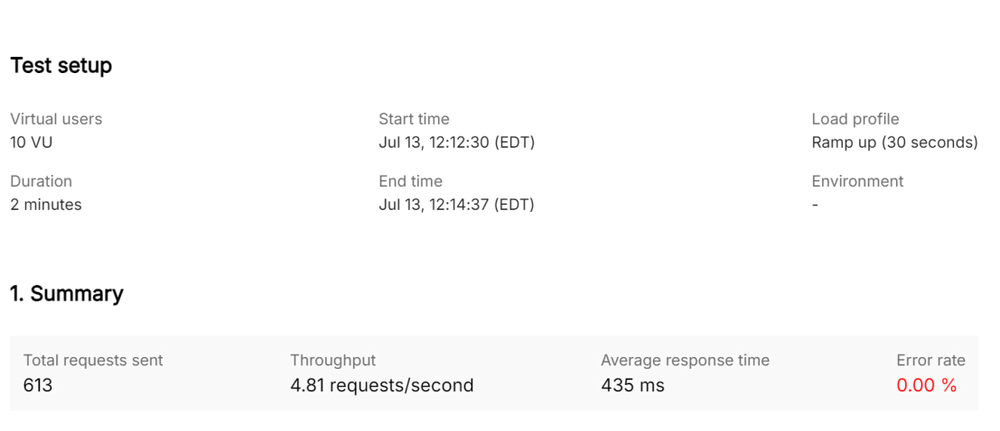
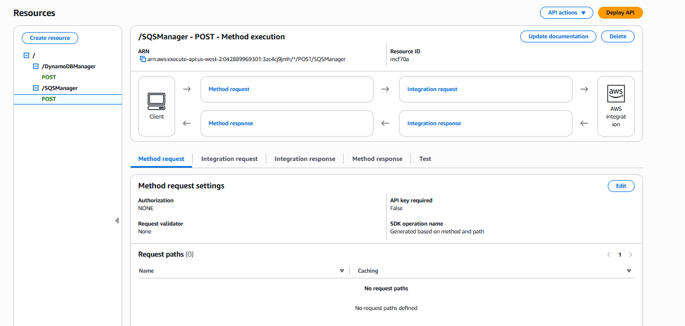
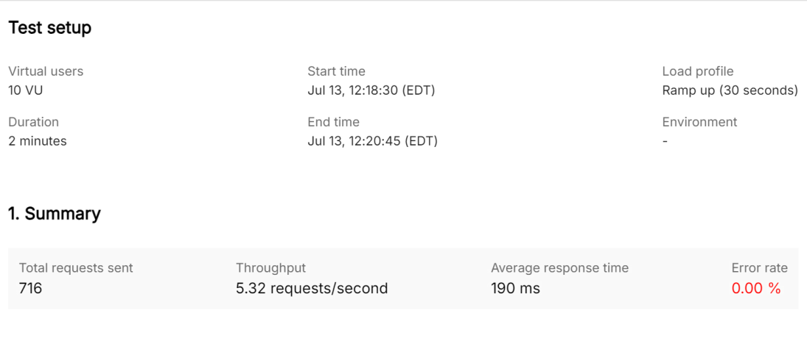

# 🚀 Serverless Architecture: API Gateway → SQS → Lambda → DynamoDB

This project demonstrates a decoupled, fault‑tolerant **serverless pattern** built on AWS.
It was implemented as part of my AWS Solutions Architect learning journey and tested with Postman for performance tuning.

---

## 📌 Overview

**High-level flow:**

1. ✅ Client sends an **HTTPS POST** request to **Amazon API Gateway**.
2. ✅ API Gateway uses a **mapping template** to transform the payload and forwards it to **Amazon SQS**.
3. ✅ **AWS Lambda** is triggered by SQS to process each message.
4. ✅ Lambda performs **CRUD operations** on **Amazon DynamoDB**.

✔ **Why this pattern?**

* Buffers traffic with SQS for resilience
* Scales automatically with Lambda
* Serverless (no servers to manage)
* Pay-per-use and cost‑efficient
* Easy to extend with additional consumers or DLQs

---

## 🏗️ Architecture Diagram


---

## 🔧 Steps Performed

* Created a **DynamoDB** table with partition key and attributes.

* Implemented a **Lambda function** (`lambda/handler.py`) to process SQS records and perform database operations.

* Configured **SQS** as a standard queue with permissions for Lambda and API Gateway.

Access Policy: To give access to SQSSendMessage Role to insert records to SQS Queue

{

&#x20; "Version": "2012-10-17",

&#x20; "Id": "\_\_default\_policy\_ID",

&#x20; "Statement": \[

&#x20;   {

&#x20;     "Sid": "\_\_owner\_statement",

&#x20;     "Effect": "Allow",

&#x20;     "Principal": {

&#x20;       "AWS": "arn\:aws\:iam::042889969301\:root"

&#x20;     },

&#x20;     "Action": "SQS:\*",

&#x20;     "Resource": "arn\:aws\:sqs\:us-west-2:042889969301\:serverless\_queue"

&#x20;   },

&#x20;   {

&#x20;     "Sid": "AllowAPIGatewayRole",

&#x20;     "Effect": "Allow",

&#x20;     "Principal": {

&#x20;       "AWS": "arn\:aws\:iam::042889969301\:role/SQSSendMessage"

&#x20;     },

&#x20;     "Action": "sqs\:SendMessage",

&#x20;     "Resource": "arn\:aws\:sqs\:us-west-2:042889969301\:serverless\_queue"

&#x20;   }

&#x20; ]

}

* Linked **SQS as an event source** for Lambda.

  Lambda Trigger:


* Configured **API Gateway**:

  * Created `POST /SQSManager` resource.
  * Integrated with SQS (`SendMessage` action).
  
  * Added mapping template:

    ```velocity
    Action=SendMessage&QueueUrl=https://sqs.us-west-2.amazonaws.com/<account-id>/<queue-name>&MessageBody=$util.urlEncode($input.body)
    ```
  * Deployed to stage `Prod1`.

* Tested using **Postman** by sending JSON payloads.

---

## 📈 Performance Analysis

Performed load testing using a Postman collection and tuned Lambda memory allocation:

| Memory (MB) | Avg. Response Time |  
| ----------- | ------------------ | 
|             |                    | 
| 128         | 435 ms             | 
| 1024        | 190 ms             | 


✅ **Key findings:**

* Increasing Lambda memory reduced execution latency.
* Achieved a better cost/performance trade‑off.

📊 *See performance graphs here:*
\\


